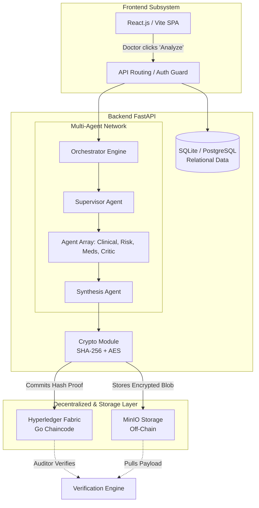

# 🏥 Blockchain-Secured Multi-Agent Clinical Decision Support System
**Official Architecture, Onboarding, and Technical Documentation**

---

## 1. Introduction: What is this project and why was it built?

### What is it?
This project is an enterprise-grade, **Multi-Agent Artificial Intelligence System** tightly integrated with a **Hyperledger Fabric Blockchain**. It is designed to act as an advanced clinical decision-support tool for doctors and hospitals. Instead of asking a single AI a medical question and hoping it does not hallucinate, this system breaks down the clinical reasoning process across multiple, highly specialized AI "agents" that verify each other's work and cryptographically lock their decisions onto an immutable ledger.

### Why was it built?
The integration of AI into healthcare faces three massive hurdles:
1. **The "Black Box" Problem:** Doctors cannot trust a single LLM output without knowing *how* it reached its conclusion.
2. **Hallucination Risk:** Single models often invent medical facts. 
3. **Legal & Audit Liability:** If an AI assists in a misdiagnosis, hospitals need an immutable cryptographic trail of exactly what the AI saw and what it recommended at that exact second in time.

This project was built to solve these problems. It enforces **accountability, traceability, and clinical safety** by mapping complex multi-step reasoning onto a decentralized ledger.

---

## 2. Competitive Advantage: Why this approach over traditional methods?

| Feature | Traditional Healthcare AI (e.g., ChatGPT / Standard LLM) | Our System (Blockchain + Multi-Agent) |
| :--- | :--- | :--- |
| **Reasoning Model** | Monolithic (One prompt, one answer). High hallucination risk. | Distributed. Ten specialized agents cross-check and debate findings before outputting. |
| **Accountability** | None. Conversations can be deleted or altered in database silos. | 100% Immutable. Every AI decision is hashed (SHA-256) and committed to Hyperledger Fabric. |
| **Data Privacy** | Sends raw patient data to third parties. | Employs AES-GCM encryption natively. Only cryptographic hashes go on-chain; encrypted blobs sit safely in isolated MinIO buckets. |
| **Auditing & Forensics** | Impossible to prove what the AI generated in a medical malpractice suit. | Mathematical certainty. A tamper-engine algorithm detects if a byte of AI output was altered post-decision. |

---

## 3. Technology Stack & Justifications

To achieve a production-ready, highly secure architecture, the following stack was chosen:

### **Frontend: React.js + Vite + TailwindCSS**
*   **Why?** React (via Vite) offers the fastest local development loops and easiest component modularity. We utilize TailwindCSS to implement a modern, premium "glassmorphic" UI interface that feels trusted, sleek, and intuitive for both Doctors and Patients.
*   **Data Fetching:** ``@tanstack/react-query`` is used for intelligent caching, minimizing unnecessary API requests to the fast backend.

### **Backend: Python + FastAPI + SQLAlchemy**
*   **Why?** Python is the undisputed king of AI ecosystems. By marrying it with FastAPI, we achieve incredible asynchronous throughput (non-blocking I/O). 
*   **Database:** SQLAlchemy is used to handle our relational data (Users, Patients, Doctors, Appointments). We use *aiosqlite* for local development, which can easily scale to *PostgreSQL* for production.

### **AI Engine: Groq (Llama 3)**
*   **Why?** In a multi-agent system, latency compounds. If 6 agents need to run sequentially, a standard OpenAI GPT-4 API might take 45 seconds. Groq utilizes custom LPU (Language Processing Unit) hardware to infer at hundreds of tokens per second, allowing an entire multi-agent consensus network to resolve in seconds.

### **Blockchain: Hyperledger Fabric & Go Chaincode**
*   **Why?** We cannot use public blockchains like Ethereum because healthcare data requires absolute privacy, and transaction "gas fees" are unacceptable for hospital infrastructure. Hyperledger Fabric is a strictly *permissioned*, enterprise-grade network where organizations (e.g., the Hospital and a third-party Auditing Firm) run secure, private ledger nodes.

### **Storage: MinIO (S3-Compatible)**
*   **Why?** Blockchains are terrible at storing large files. We only store the *Hash* of the AI output on the blockchain. The actual generated JSON report is AES-encrypted and pushed to MinIO (a private S3 replacement).

---

## 4. The Intelligence: Multi-Agent Hub

There are currently **10 Specialized Clinical Agents** existing natively within `backend/agents/llm/clinical_agents.py`. 

Instead of a single endpoint, the **Supervisor Agent** reads incoming cases and routes them appropriately to:
1.  **Clinical Reasoning Agent:** Formulates differential diagnoses.
2.  **Medical History Agent:** Parses longitudinal patient charts.
3.  **Laboratory Analysis Agent:** Analyzes biomarker strings and highlights anomalies.
4.  **Pharmacotherapy Agent:** Checks for drug interactions and allergies.
5.  **Risk Assessment Agent:** Calculates acuity (Critical, High, Med, Low).
6.  **Evidence-Based Medicine Agent:** Matches diagnoses to clinical guidelines (e.g., ACC, AHA).
7.  **Peer Review Critic Agent:** Acts as an adversarial reviewer to deeply spot-check the previous outputs for cognitive biases or logical failures.
8.  **Verifier Agent:** Enforces that no suggestion causes direct patient harm.
9.  **Synthesis Agent:** Merges everything into a highly readable, human-facing clinical summary.

---

## 5. Architectural Anchor Diagram 

---

## 6. Security, Cryptography & Flow

What makes this system revolutionary is its zero-trust flow:
1.  **AI Finalizes JSON Output:** The Synthesis Agent generates a clinical report.
2.  **Canonicalization:** The JSON is sorted alphabetically by keys to ensure the exact same byte string across operating systems.
3.  **SHA-256 Hashing:** A mathematical hash fragment is generated (e.g., `8d2f6...`).
4.  **AES-GCM Encryption:** The JSON is encrypted with a master secure key.
5.  **Off-chain Storage:** The encrypted file is saved into the hospital's private MinIO server.
6.  **On-chain Execution:** The backend scripts use `grpc` to communicate with the Hyperledger network, saving the `TaskID`, the `AgentID`, and the `SHA-256 Hash` onto the blockchain forever.

If a hacker or adversarial administrator modifies the MinIO bucket to hide a mistake, the new file’s hash will mathematically miss the one baked into the blockchain, instantly triggering an **Anomaly Detection** audit event and crashing the verification dashboard.

---

## 7. Deep-Dive File Structure

Understanding the repository is crucial for onboarding new developers.

### **`backend/` (FastAPI Core)**
*   **`app.py`:** The massive central configuration point. Binds all routes, mounts authentications, and seeds databases.
*   **`agents/`:**
    *   `llm/clinical_agents.py`: Contains the actual System Instructions and Prompt capabilities for the 10 core agents.
    *   `mock/mock_agents.py`: Overrides the system natively if `AI_MODE="mock"` is defined in the `.env`, allowing developers to write UI code without burning LLM tokens.
*   **`api/`:** The FastAPI routers (e.g. `auth.py`, `hospital.py`). This is the bridge between the UI and Python.
*   **`blockchain/`:**
    *   `gateway.py`: Houses the SDK connections allowing Python to safely push and fetch parameters from the Go Hyperledger setup.
*   **`core/`:**
    *   `config.py`: The `.env` reader holding database URLs and keys.
    *   `security.py`: The JWT parsing logic and bcrypt password hashing.
*   **`crypto/`:** Custom written generic wrappers computing `SHA-256` and handling `AES` encoding.
*   **`models/`:**
    *   `models.py`: AI and Task-focused Database definitions (Runs, AI Logs, Trust Scores)
    *   `hospital.py`: Domain-specific Database blueprints (Patients, Doctors, Appointments).
*   **`orchestrator/`:**
    *   `workflow.py`: The most critical loop in the app. Defines precisely how the agents iterate, where they halt, and runs the entire 25-step execution queue.

### **`frontend/` (React SPA)**
*   **`src/App.tsx`:** Defines logic routing. Uses strict Role-Guards (`RequireRole`) to block unauthorized portal access natively.
*   **`src/components/Layout.tsx`:** The dynamic master sidebar rendering intelligent Navigation elements depending on whether an `Admin`, `Doctor`, or `Patient` is viewing.
*   **`src/lib/`:**
    *   `api.ts` & `hospitalApi.ts`: Wraps `fetch()` allowing native queries explicitly to FastAPI routes.
*   **`src/pages/`:**
    *   `/admin/`: Pages dictating blockchain verification and generic high-level dashboards.
    *   `/doctor/`: The Physician portal. Intended for Patient viewing, AI report invocations, and appointments.
    *   `/patient/`: The specific end-user portal tracking personal prescriptions and records.

---

## 8. Summary for the Team

This project isn’t just a simple UI stacked safely over ChatGPT. It is an **Enterprise Distributed Infrastructure**.

**To safely develop inside this project, Engineers should:**
1.  Recognize that the AI workflow in `workflow.py` requires all agents to output strictly structured JSON, otherwise the Pydantic schemas will crash. 
2.  Be aware that altering models in `hospital.py` requires deep awareness of how Frontend elements track `id` elements (UUID format).
3.  Respect the dual environment capability: Ensure `.env` is set to `mock` when designing frontend screens, and exclusively utilize production keys in secure configurations when integrating Hyperledger interactions.

*(End of Documentation)*
