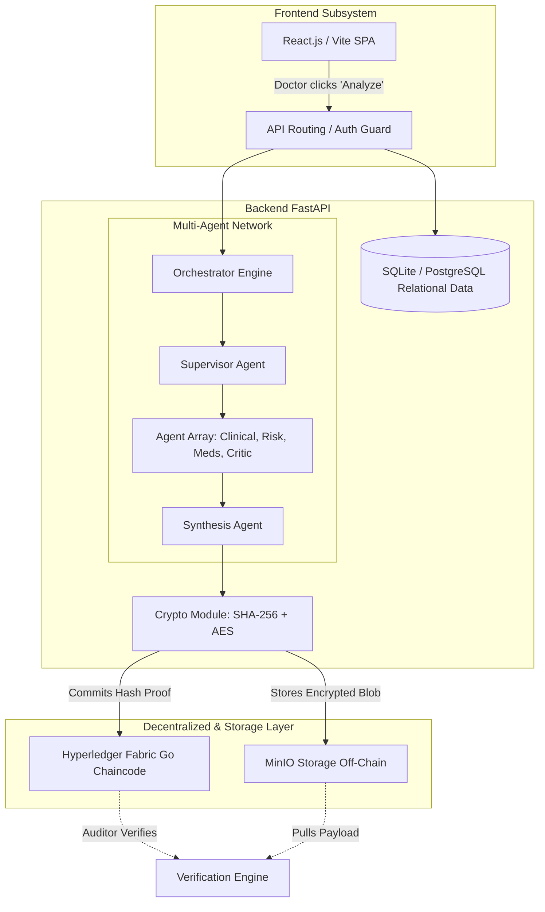

<div align="center">

# 🏥 Blockchain-Secured Privacy-Preserving Multi-Agent Clinical Decision Support System

[](https://opensource.org/licenses/MIT)
[](https://www.python.org/downloads/)
[](https://fastapi.tiangolo.com)
[](https://reactjs.org/)
[](https://www.hyperledger.org/use/fabric)

*An enterprise-grade, Multi-Agent Artificial Intelligence System tightly integrated with a Hyperledger Fabric Blockchain for secure, accountable, and hallucination-free clinical decision support.*

---


</div>

## 📖 Overview

The integration of AI into healthcare faces three massive hurdles:
1. **The "Black Box" Problem:** Doctors cannot trust a single LLM output without knowing *how* it reached its conclusion.
2. **Hallucination Risk:** Single models often invent medical facts. 
3. **Legal & Audit Liability:** If an AI assists in a misdiagnosis, hospitals need an immutable cryptographic trail of exactly what the AI saw and what it recommended at that exact second in time.

This project solves these problems by enforcing **accountability, traceability, and clinical safety**. It maps complex multi-step reasoning onto a decentralized ledger, breaking down the clinical reasoning process across **10 highly specialized AI agents** that verify each other's work and cryptographically lock their decisions onto an immutable ledger.

---

## ✨ Key Features & Use Cases

### 🛡️ Uncompromised Security & Privacy
- **AES-GCM Encryption:** Patient data is encrypted before storage.
- **MinIO Storage:** Only cryptographic hashes go on-chain; encrypted blobs sit safely in isolated MinIO buckets.
- **Zero-Trust Flow:** Tamper-engine algorithm detects if a single byte of AI output was altered post-decision.

### 🤖 Multi-Agent AI System
Instead of a single endpoint, a **Supervisor Agent** routes cases to a network of specialists:
- **Clinical Reasoning Agent:** Formulates differential diagnoses.
- **Medical History Agent:** Parses longitudinal patient charts.
- **Laboratory Analysis Agent:** Analyzes biomarker strings and highlights anomalies.
- **Pharmacotherapy Agent:** Checks for drug interactions and allergies.
- **Risk Assessment Agent:** Calculates acuity (Critical, High, Med, Low).
- **Evidence-Based Medicine Agent:** Matches diagnoses to clinical guidelines (e.g., ACC, AHA).
- **Peer Review Critic Agent:** Deeply spot-checks outputs for cognitive biases or logical failures.
- **Verifier Agent:** Enforces that no suggestion causes direct patient harm.
- **Synthesis Agent:** Merges everything into a highly readable, human-facing clinical summary.

### 🔗 Blockchain Provenance
- **100% Immutable:** Every AI decision is hashed (SHA-256) and committed to **Hyperledger Fabric**.
- **Audit Trails:** Mathematical certainty in auditing. Ideal for medical malpractice forensics.

---

## 🏗️ Architecture



---

## 🛠️ Technology Stack

| Layer | Technology | Justification |
| --- | --- | --- |
| **Frontend** | React.js, Vite, TailwindCSS | Fast local development loops, premium glassmorphic UI, responsive design. |
| **Backend** | Python, FastAPI, SQLAlchemy | Asynchronous throughput, seamless AI ecosystem integration. |
| **AI Engine** | Groq (Llama 3) | LPU hardware inference at hundreds of tokens per second for fast multi-agent consensus. |
| **Blockchain** | Hyperledger Fabric | Permissioned, enterprise-grade network ensuring absolute privacy without gas fees. |
| **Storage** | MinIO (S3-Compatible) | Secure, off-chain storage for encrypted JSON reports. |

---

## 📂 Folder Structure

```text
📦 Blockchain-Secured-Privacy-Preserving-Multi-Agent-Clinical-Decision-Support-System
 ┣ 📂 backend
 ┃ ┣ 📂 agents        # LLM Clinical Agents & Mock Agents
 ┃ ┣ 📂 api           # FastAPI Routers (Auth, Hospital)
 ┃ ┣ 📂 blockchain    # Hyperledger SDK gateways
 ┃ ┣ 📂 core          # Configs & Security
 ┃ ┣ 📂 crypto        # SHA-256 and AES wrappers
 ┃ ┣ 📂 models        # Database schemas
 ┃ ┗ 📂 orchestrator  # Multi-agent workflow execution queue
 ┣ 📂 frontend
 ┃ ┣ 📂 src
 ┃ ┃ ┣ 📂 components  # Reusable UI components
 ┃ ┃ ┣ 📂 pages       # Admin, Doctor, and Patient portals
 ┃ ┃ ┗ 📂 lib         # API wrappers
 ┣ 📂 blockchain      # Hyperledger Fabric configuration and chaincode
 ┣ 📂 infrastructure  # Docker & Deployment scripts
 ┗ 📜 docker-compose.yml
```

---

## 🚀 Progress & Roadmap

- [x] **Phase 1:** Core FastAPI & React Project Setup
- [x] **Phase 2:** Multi-Agent Network Implementation (10 Specialized Agents)
- [x] **Phase 3:** Groq Integration for high-speed inference
- [x] **Phase 4:** Hyperledger Fabric Blockchain Setup & Go Chaincode
- [x] **Phase 5:** MinIO Off-chain Storage & AES-GCM Encryption
- [ ] **Phase 6:** End-to-End Testing & Auditing Dashboard Refinement
- [ ] **Phase 7:** Production Deployment via Kubernetes

---

## 💻 Installation & Setup

### Prerequisites
- Node.js (v18+)
- Python (v3.10+)
- Docker & Docker Compose
- Git

### 1. Clone the Repository
```bash
git clone https://github.com/haashid/Blockchain-Secured-Privacy-Preserving-Multi-Agent-Clinical-Decision-Support-System.git
cd Blockchain-Secured-Privacy-Preserving-Multi-Agent-Clinical-Decision-Support-System
```

### 2. Backend Setup
```bash
cd backend
python -m venv venv
source venv/bin/activate  # On Windows use `venv\Scripts\activate`
pip install -r requirements.txt
cp .env.example .env      # Update your Groq API keys and configurations
uvicorn app:app --reload
```

### 3. Frontend Setup
```bash
cd frontend
npm install
npm run dev
```

### 4. Blockchain & Infrastructure Setup
Ensure Docker is running, then start the Hyperledger and MinIO instances:
```bash
docker-compose up -d
```

---

## 🤝 Contributing

We welcome contributions! Please follow the standard fork-and-pull-request workflow. Ensure that you test your changes locally, especially if modifying the multi-agent workflow or blockchain chaincode.

---

## 📄 License

This project is licensed under the MIT License.

<div align="center">
  <i>Built with ❤️ for a safer, more accountable future in healthcare AI.</i>
</div>
