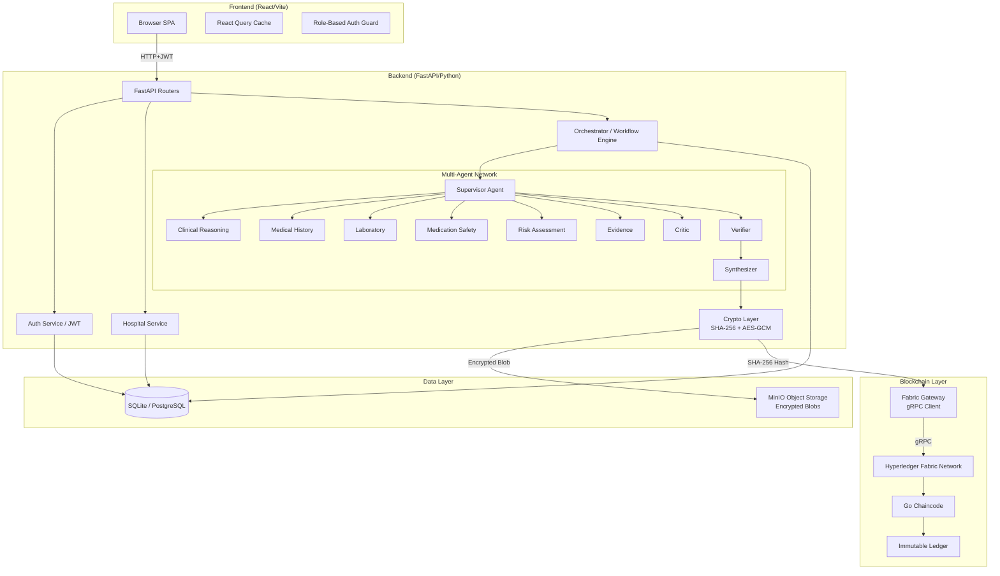
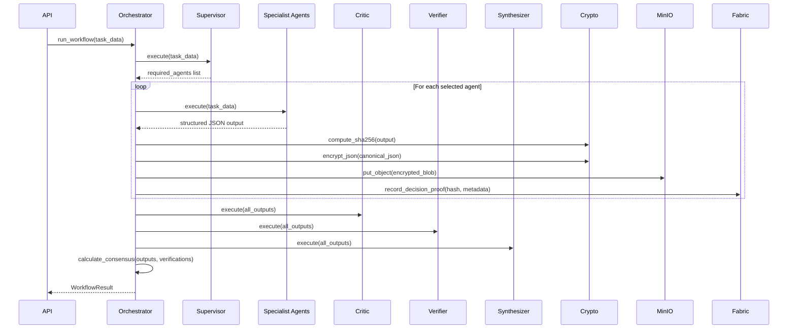
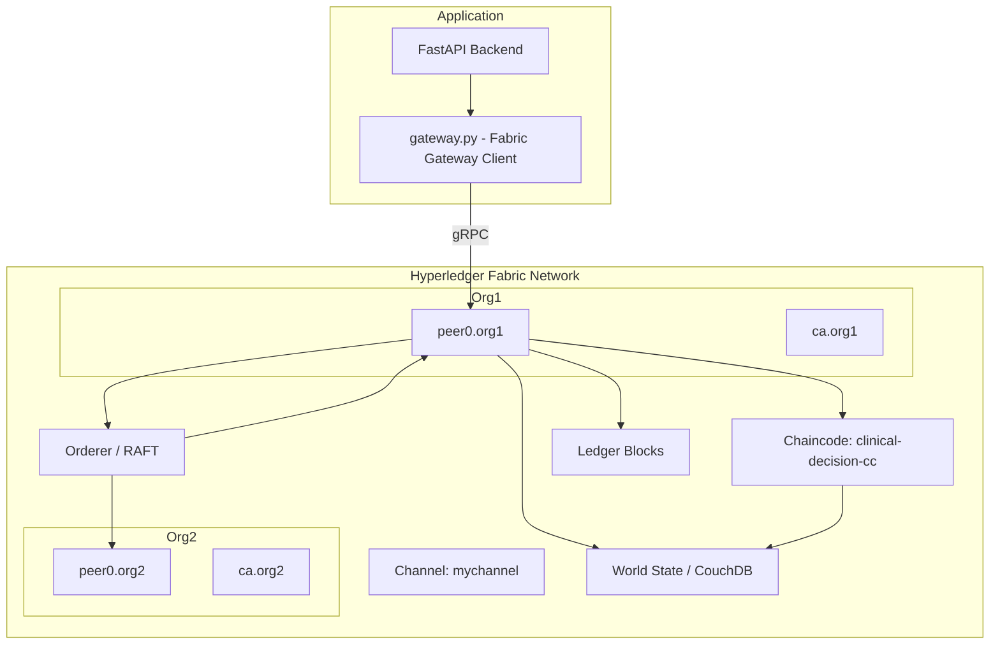
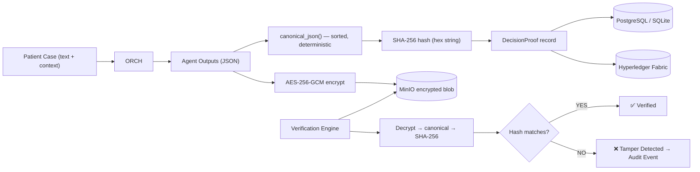
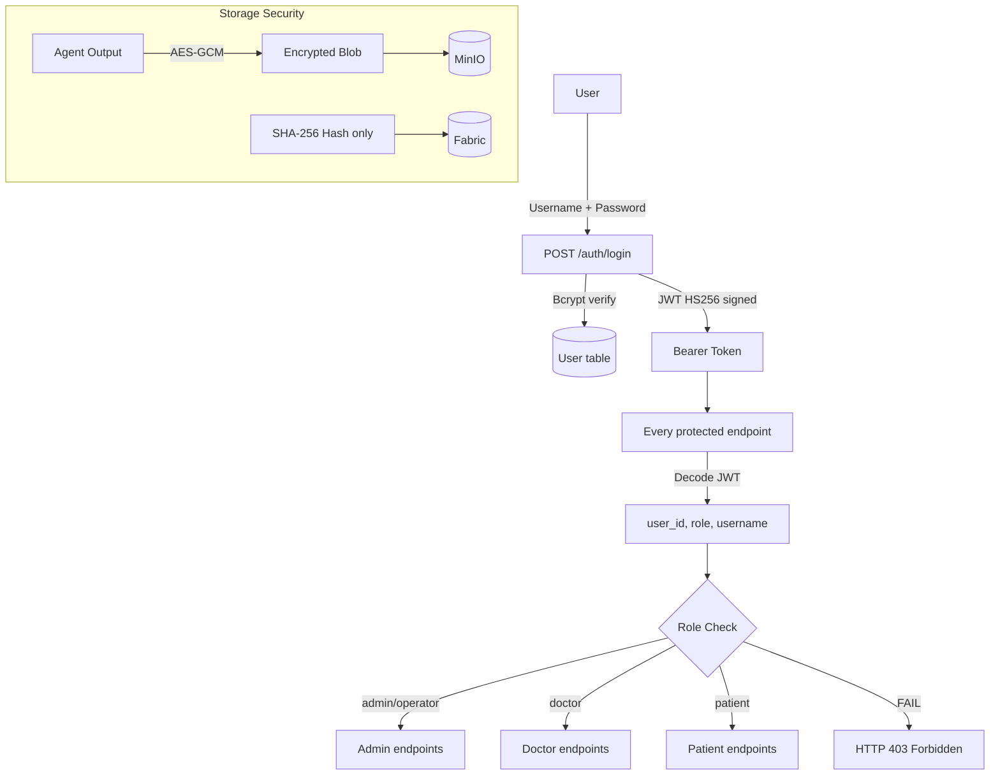

# 03 — System Architecture

## Overall Architecture

---

## Component Architecture

### Layer 1: Frontend (Presentation)
- **Technology**: React + Vite + TailwindCSS
- **Purpose**: Role-aware UI portals for admin, doctor, patient
- **Communication**: REST API over HTTPS with JWT bearer tokens
- **State**: React Query for server state; localStorage for auth token and role

### Layer 2: API (Gateway)
- **Technology**: FastAPI (Python asyncio)
- **Purpose**: HTTP endpoints, input validation, authentication enforcement
- **Files**: `backend/api/*.py`

### Layer 3: Service (Business Logic)
- **Technology**: SQLAlchemy AsyncSession
- **Purpose**: Domain CRUD operations (auth, hospital, tasks, agents)
- **Files**: `backend/services/*.py`

### Layer 4: Orchestrator (AI Coordination)
- **Technology**: Pure Python async
- **Purpose**: Execute the ordered agent chain, enforce crypto pipeline
- **Files**: `backend/orchestrator/workflow.py`

### Layer 5: Agents (AI Reasoning)
- **Technology**: Groq API (LLM mode) or rule-based stubs (mock mode)
- **Purpose**: Specialized clinical reasoning tasks
- **Files**: `backend/agents/llm/`, `backend/agents/mock/`

### Layer 6: Crypto (Security)
- **Technology**: Python `hashlib`, `cryptography` library
- **Purpose**: Canonical JSON → SHA-256 → AES-GCM
- **Files**: `backend/crypto/`

### Layer 7: Storage (Off-Chain)
- **Technology**: MinIO (Boto3 SDK)
- **Purpose**: Store encrypted agent output blobs
- **Files**: `backend/storage/`

### Layer 8: Blockchain (Provenance)
- **Technology**: Hyperledger Fabric (Go chaincode, gRPC gateway)
- **Purpose**: Immutable hash proof recording
- **Files**: `backend/blockchain/gateway.py`, `blockchain/chaincode/`

---

## AI Agent Architecture

---

## Hospital Workflow

```mermaid
flowchart LR
    A[Doctor Login] --> B[Select / Create Patient]
    B --> C[Open Patient Record]
    C --> D[Write Clinical Case Description]
    D --> E[Submit AI Analysis Request]
    E --> F[Task Created in Database]
    F --> G[Orchestrator Executes Workflow]
    G --> H[10 Agents Run Sequentially]
    H --> I[Cryptographic Pipeline]
    I --> J[Result Stored + Blockchain Proof]
    J --> K[Doctor Reviews Clinical Summary]
    K --> L[Human Clinical Decision]
```

---

## Blockchain Architecture  

---

## Data Flow Architecture

---

## Security Architecture

