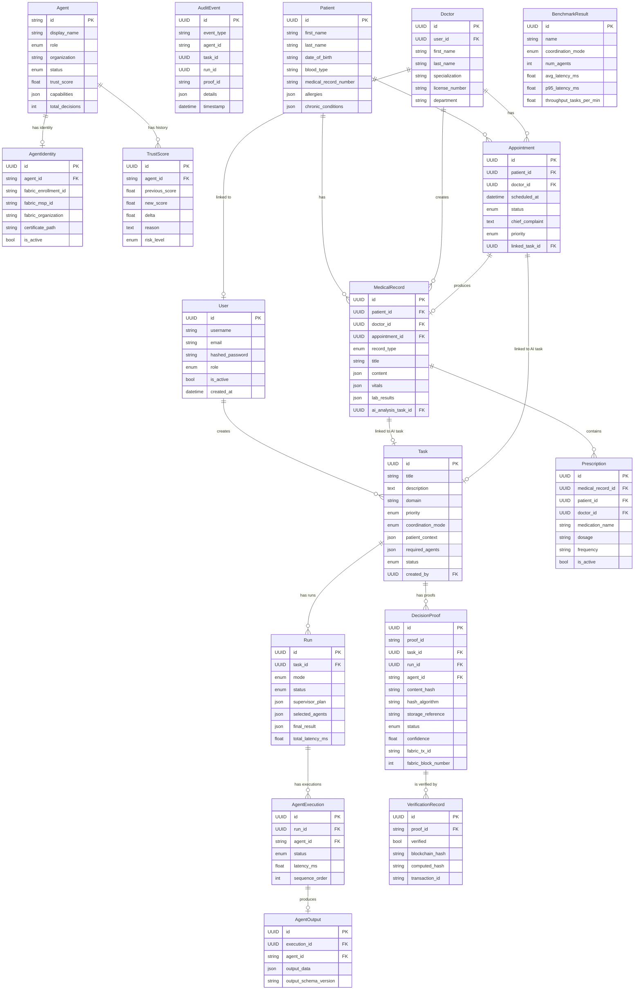

# 07 — Database Architecture

## ER Diagram



---

## Table Reference

### `users`
**Purpose**: Authentication and authorization for all system users.

| Column | Type | Notes |
|--------|------|-------|
| `id` | UUID PK | Auto-generated |
| `username` | VARCHAR(100) | Unique, indexed |
| `email` | VARCHAR(255) | Unique, indexed |
| `hashed_password` | VARCHAR(255) | bcrypt hash |
| `role` | ENUM | admin, operator, auditor, viewer, doctor, patient |
| `is_active` | BOOL | Soft disable |
| `created_at` | TIMESTAMPTZ | Auto |
| `updated_at` | TIMESTAMPTZ | Auto-updated |

---

### `agents`
**Purpose**: Registry of AI agent identities tracked in the system.

| Column | Type | Notes |
|--------|------|-------|
| `id` | VARCHAR(100) PK | e.g. `"agent-clinical_reasoning-01"` |
| `display_name` | VARCHAR(200) | Human label |
| `role` | ENUM | supervisor, clinical_reasoning, history, laboratory, medication, risk, evidence, critic, verifier, synthesizer |
| `organization` | VARCHAR(100) | e.g. "Org1MSP" |
| `status` | ENUM | active, inactive, suspended, error |
| `trust_score` | FLOAT | Starts at 100.0 |
| `capabilities` | JSON | List of capability strings |
| `total_decisions` | INT | Incremented each run |
| `verification_successes` | INT | Verified outputs |
| `anomalies_detected` | INT | Detected issues |

---

### `tasks`
**Purpose**: A clinical case analysis request.

| Column | Type | Notes |
|--------|------|-------|
| `id` | UUID PK | |
| `title` | VARCHAR(500) | Case title |
| `description` | TEXT | Clinical case text |
| `domain` | VARCHAR(100) | "healthcare" |
| `priority` | ENUM | low, medium, high, critical |
| `coordination_mode` | ENUM | centralized, blockchain |
| `patient_context` | JSON | Structured patient data dict |
| `required_agents` | JSON | Override agent list |
| `status` | ENUM | pending, running, completed, failed, cancelled |
| `created_by` | UUID FK → users | |

---

### `runs`
**Purpose**: A single execution of a task through the workflow engine.

| Column | Type | Notes |
|--------|------|-------|
| `id` | UUID PK | |
| `task_id` | UUID FK → tasks | |
| `mode` | ENUM | centralized, blockchain |
| `status` | ENUM | pending, running, completed, failed, timeout |
| `supervisor_plan` | JSON | Supervisor agent output |
| `selected_agents` | JSON | Agents that ran |
| `final_result` | JSON | Complete WorkflowResult |
| `consensus_result` | JSON | Consensus scores |
| `total_latency_ms` | FLOAT | Wall-clock time |

---

### `decision_proofs`
**Purpose**: Cryptographic proof record for one agent's output.

| Column | Type | Notes |
|--------|------|-------|
| `proof_id` | VARCHAR(200) UNIQUE | `"proof-{run_id[:8]}-{role}"` |
| `task_id` | UUID FK | |
| `run_id` | UUID FK | |
| `agent_id` | VARCHAR(100) FK | |
| `content_hash` | VARCHAR(64) | SHA-256 hex of agent output |
| `hash_algorithm` | VARCHAR(20) | "SHA-256" |
| `storage_reference` | VARCHAR(500) | MinIO object path |
| `status` | ENUM | submitted, verified, invalid, flagged |
| `confidence` | FLOAT | Agent's self-reported confidence |
| `fabric_tx_id` | VARCHAR(200) | Fabric TX ID (or `local-{hex}`) |
| `fabric_block_number` | INT | Block committed at |
| `fabric_ledger_status` | VARCHAR(50) | "committed", "local", "failed" |

---

### `verifications`
**Purpose**: Result of re-verifying a decision proof.

| Column | Type | Notes |
|--------|------|-------|
| `proof_id` | FK → decision_proofs | |
| `verified` | BOOL | True = hash matched |
| `blockchain_hash` | VARCHAR(64) | Hash from Fabric |
| `computed_hash` | VARCHAR(64) | Hash from decrypted MinIO |
| `failures` | JSON | List of failure descriptions |

---

### `audit_events`
**Purpose**: Append-only log of all significant events.

Important `event_type` values:
- `task.created`, `run.started`, `run.completed`
- `supervisor.plan_ready`, `agent.started`, `agent.completed`, `agent.failed`
- `hash.generated`, `storage.saved`, `blockchain.committed`, `blockchain.failed`
- `verification.hash_mismatch` ← critical security event
- `tamper.simulated`

---

### `trust_scores`
**Purpose**: Historical log of every trust score change for an agent.

| Column | Type | Notes |
|--------|------|-------|
| `agent_id` | FK → agents | |
| `previous_score` | FLOAT | Score before event |
| `new_score` | FLOAT | Score after event |
| `delta` | FLOAT | Positive or negative |
| `reason` | TEXT | Human-readable reason |
| `risk_level` | ENUM | trusted(>90), normal(70-90), warning(50-70), suspicious(30-50), critical(<30) |

---

### Hospital Tables

### `patients`
Stores demographic and medical information for patients.
- `medical_record_number` — Unique hospital identifier.
- `allergies` — JSON list (e.g. `["Penicillin", "Sulfa"]`).
- `chronic_conditions` — JSON list.

### `doctors`
Links a hospital doctor to a `users` record. 
- `user_id` FK → `users` (one-to-one).
- Stores specialization, license number, department.

### `appointments`
Links patients and doctors with scheduling data.
- `linked_task_id` → `tasks` — connects appointments to AI analysis.
- Status: scheduled, in_progress, completed, cancelled.

### `medical_records`
Core clinical documentation.
- `ai_analysis_task_id` → `tasks` — connects records to AI pipeline.
- `content` — JSON blob of clinical data.
- `vitals`, `lab_results`, `prescriptions` — structured JSON fields.

### `prescriptions`
Individual medication prescriptions.
- Links to `medical_record`, `patient`, `doctor`.
- Tracks dosage, frequency, duration, active status.

---

## Key Relationships

```
User → Task (one Doctor user creates many Tasks)
Task → Run (one task can be run multiple times)
Run → AgentExecution (one run triggers N agent executions)
AgentExecution → AgentOutput (one execution → one structured output)
Task → DecisionProof (one per agent per run)
DecisionProof → VerificationRecord
Doctor → MedicalRecord → ai_analysis_task_id → Task
Appointment → linked_task_id → Task
```

---

## Important Notes

1. **No Alembic migrations folder** — Database is created via `Base.metadata.create_all()` at startup. Suitable for development; needs Alembic for production schema evolution.

2. **`doctor_id` not on `User.patient_id`** — Patients are NOT directly linked to the `users` table. They exist as independent `Patient` records. The seeding code creates demo patients separately.

3. **Fabric TX IDs in DB** — If Fabric is unavailable, `fabric_tx_id` is set to `"local-{hex}"`. Easy to distinguish: real TX IDs come from Fabric chaincode; local IDs are synthetic.

4. **UUID dialect** — Uses `sqlalchemy.dialects.postgresql.UUID`. SQLite handles UUIDs as strings — works correctly in dev.
