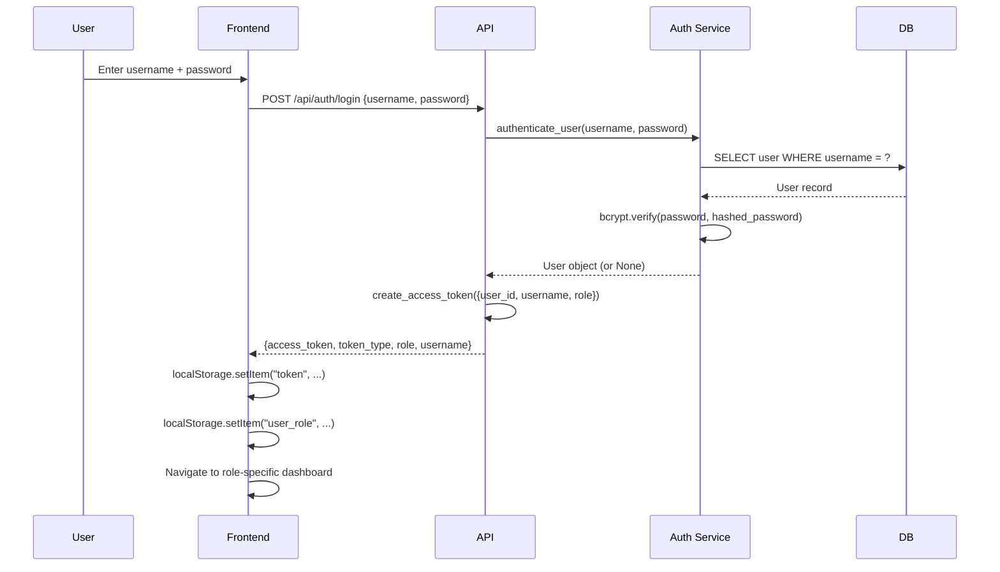

# 08 — Authentication & Authorization

## Overview

The system uses a standard **JWT Bearer Token** authentication mechanism with **Role-Based Access Control (RBAC)** enforced at both the backend API layer and the frontend routing layer.

> ⚠️ **Security Principle**: Frontend route hiding is NOT security. Only server-side authorization counts. This project enforces authorization on the backend for all sensitive endpoints.

---

## Authentication Flow



---

## JWT Token Structure

The token is signed with HS256 (HMAC-SHA256).

**Payload (claims)**:
```json
{
  "sub": "<user_id>",
  "username": "doctor1",
  "role": "doctor",
  "exp": 1725360000
}
```

**Configuration** (from `config.py`):
- Algorithm: `HS256`
- Expiry: `JWT_EXPIRY_MINUTES` (default 60 minutes)
- Secret: `JWT_SECRET_KEY` from `.env` (redacted)

---

## Password Security

**Library**: `passlib` with `bcrypt` backend.

```python
# On registration:
hashed = bcrypt.hash(plain_password)    # Adaptive cost factor, random salt embedded

# On login:
bcrypt.verify(plain_password, hashed)   # Constant-time comparison built-in
```

**Why bcrypt?**
- Adaptive cost factor — can be increased as hardware improves.
- Built-in salt — no salt management needed.
- Resistant to rainbow table attacks.
- Timing-safe by design.

---

## Supported Roles

| Role | Description | Primary Access |
|------|-------------|---------------|
| `admin` | Full system control | All endpoints, all portals |
| `operator` | Runs tasks, manages agents | Task/Run/Agent admin endpoints |
| `auditor` | Read-only audit access | Audit, verification, blockchain |
| `viewer` | Read-only access | General dashboard |
| `doctor` | Clinical portal | Doctor portal, hospital APIs, task submission |
| `patient` | Patient portal | Own records only |

---

## Permission Matrix

| Endpoint | admin | operator | auditor | viewer | doctor | patient |
|----------|-------|----------|---------|--------|--------|---------|
| POST /auth/register | ✅ | ❌ | ❌ | ❌ | ❌ | ❌ |
| GET /auth/me | ✅ | ✅ | ✅ | ✅ | ✅ | ✅ |
| POST /tasks | ✅ | ✅ | ❌ | ❌ | ✅ | ❌ |
| GET /tasks | ✅ | ✅ | ✅ | ✅ | ✅ | ❌ |
| POST /tasks/{id}/execute | ✅ | ✅ | ❌ | ❌ | ✅ | ❌ |
| GET /agents | ✅ | ✅ | ✅ | ✅ | ❌ | ❌ |
| GET /audit | ✅ | ✅ | ✅ | ❌ | ❌ | ❌ |
| GET /blockchain/proofs | ✅ | ✅ | ✅ | ❌ | ✅ | ❌ |
| GET /hospital/patients | ✅ | ❌ | ❌ | ❌ | ✅ | ❌ |
| GET /hospital/patients/{id} | ✅ | ❌ | ❌ | ❌ | ✅ | ✅* |
| GET /hospital/doctors | ✅ | ❌ | ❌ | ❌ | ✅ | ✅ |
| POST /hospital/appointments | ✅ | ❌ | ❌ | ❌ | ✅ | ❌ |
| POST /benchmarks/run | ✅ | ✅ | ❌ | ❌ | ❌ | ❌ |

> *Patient can only see their own record (by design — IDOR risk noted, full row-level enforcement recommended for production).

---

## Backend Authorization Implementation

### `get_current_user` Dependency
```python
# backend/core/security.py or backend/api/auth.py

async def get_current_user(token = Depends(oauth2_scheme), db = Depends(get_db)):
    payload = jose.jwt.decode(token, settings.JWT_SECRET_KEY, algorithms=["HS256"])
    user_id = payload.get("sub")
    user = await db.get(User, user_id)
    if not user or not user.is_active:
        raise HTTPException(401, "Invalid credentials")
    return user

async def get_current_active_user(current_user = Depends(get_current_user)):
    if not current_user.is_active:
        raise HTTPException(400, "Inactive user")
    return current_user
```

### Role Check Dependency
```python
def check_role(*allowed_roles: str):
    async def _check(user = Depends(get_current_active_user)):
        if user.role not in allowed_roles:
            raise HTTPException(403, f"Requires role: {allowed_roles}")
        return user
    return _check

# Usage in routes:
@router.post("/tasks")
async def create_task(
    user = Depends(check_role("admin", "operator", "doctor"))
):
    ...
```

---

## Frontend Role Guards

### `RequireRole` Component (`App.tsx`)
```tsx
function RequireRole({ children, allowed }: { children: ReactNode; allowed: string[] }) {
    const token = localStorage.getItem("token");
    const role = localStorage.getItem("user_role");
    
    if (!token) return <Navigate to="/login" replace />;
    if (!allowed.includes(role ?? "")) {
        // Redirect to their own portal
        if (role === "doctor") return <Navigate to="/doctor/dashboard" replace />;
        if (role === "patient") return <Navigate to="/patient/dashboard" replace />;
        return <Navigate to="/login" replace />;
    }
    return <>{children}</>;
}
```

### Route Protection in `App.tsx`
```tsx
<Route path="/admin/*" element={
    <RequireRole allowed={["admin", "operator", "auditor", "viewer"]}>
        <Layout />
    </RequireRole>
}>
    <Route path="dashboard" element={<DashboardPage />} />
    ...
</Route>

<Route path="/doctor/*" element={
    <RequireRole allowed={["doctor"]}>
        <Layout />
    </RequireRole>
}>
    <Route path="dashboard" element={<DoctorDashboard />} />
    ...
</Route>

<Route path="/patient/*" element={
    <RequireRole allowed={["patient"]}>
        <Layout />
    </RequireRole>
}>
    <Route path="dashboard" element={<PatientDashboard />} />
    ...
</Route>
```

---

## Demo Credentials

Seeded on startup by `seed_default_data()` in `services/auth.py`:

| Username | Password | Role | Notes |
|----------|----------|------|-------|
| `admin` | `admin123` | admin | Full system access |
| `doctor1` | `doctor123` | doctor | Demo physician, Dr. Smith |
| `patient1` | `patient123` | patient | Demo patient |

---

## Security Strengths & Limitations

### Strengths
- bcrypt password hashing with built-in salt.
- Timing-safe comparison (`hmac.compare_digest` in hash verification).
- JWT expiry enforced.
- Role check on every sensitive endpoint.
- Frontend redirects prevent UI confusion.

### Limitations (Academic Scope)
- JWT secret stored in `.env` — use a secrets manager in production.
- No refresh token — users need to log in again after expiry.
- No IP-based rate limiting on login endpoint.
- No MFA (Multi-Factor Authentication).
- Patient IDOR risk: patient can theoretically request any patient ID via API (full row-level security not enforced in all endpoints).
- All backend keys in single `.env` file — single point of compromise.
