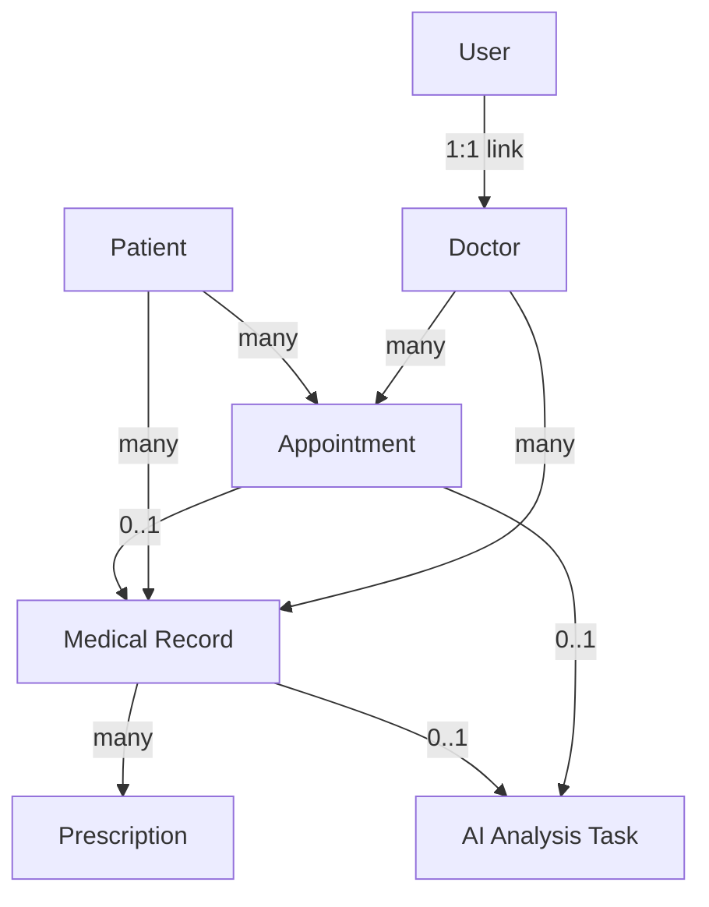

# 09 — Hospital Domain

## Domain Overview

The hospital domain models the clinical entities that make the AI analysis system meaningful in a real-world context.



---

## Entities

### Patient
**Table**: `patients`

Stores demographic and clinical baseline information for hospital patients.

**Key Fields**:
- `medical_record_number` — Unique hospital MRN (e.g., `MRN-0001`). Indexed.
- `allergies` — JSON list of known drug allergies. Passed to AI agents for medication safety checks.
- `chronic_conditions` — JSON list of ongoing conditions. Passed as patient context.
- `blood_type` — Directly relevant for surgical cases.

**Example Patient (Demo)**:
```json
{
  "first_name": "Alice",
  "last_name": "Patient",
  "date_of_birth": "1979-05-15",
  "blood_type": "O+",
  "medical_record_number": "MRN-0001",
  "allergies": ["Penicillin", "Aspirin"],
  "chronic_conditions": ["Hypertension", "Type 2 Diabetes"]
}
```

---

### Doctor
**Table**: `doctors`

Represents a medical professional with a corresponding system account.

**Key Fields**:
- `user_id` → `users.id` — The doctor also has a login account. One-to-one.
- `specialization` — e.g., "Internal Medicine", "Cardiology".
- `license_number` — Unique medical license.
- `department` — Hospital department.

**Example Doctor (Demo)**:
```json
{
  "first_name": "James",
  "last_name": "Smith",
  "specialization": "Internal Medicine",
  "license_number": "LIC-00001",
  "department": "General Medicine"
}
```

---

### Appointment
**Table**: `appointments`

Links a patient with a doctor for a clinical encounter.

**Key Fields**:
- `status`: scheduled → in_progress → completed (or cancelled).
- `chief_complaint` — The patient's primary reason for the visit.
- `priority`: routine, urgent, emergency.
- `linked_task_id` → `tasks.id` — If an AI analysis was ordered for this appointment.

---

### Medical Record
**Table**: `medical_records`

Created at the end of an appointment. Contains all clinical documentation.

**Key Fields**:
- `record_type`: consultation, lab_result, prescription, imaging, discharge_summary.
- `content` — JSON blob of structured data.
- `vitals` — JSON: `{"temp": 38.5, "bp": "140/90", "hr": 102}`.
- `lab_results` — JSON: list of test results.
- `ai_analysis_task_id` → `tasks.id` — Links the record to its AI analysis run.

---

### Prescription
**Table**: `prescriptions`

Individual medication orders from a medical record.

**Key Fields**:
- `medication_name` — Drug name.
- `dosage` — e.g., "500mg".
- `frequency` — e.g., "twice daily".
- `is_active` — Marks if currently prescribed (soft delete).

---

## How Hospital Domain Connects to AI

The bridge between hospital data and AI analysis:

```
Doctor creates MedicalRecord for Patient
    ↓
Doctor initiates AI Analysis (POST /api/tasks)
    ↓
Patient context JSON populated from Patient, MedicalRecord, Prescription data
    ↓
Orchestrator passes patient_context to all AI Agents
    ↓
AI Agents analyze: medications → medication agent, lab_results → lab agent
    ↓
Task result linked back: MedicalRecord.ai_analysis_task_id = task.id
```

---

## Seeded Demo Data

Created automatically on backend startup by `seed_default_data()` in `services/auth.py`:

**Users created:**
- `admin` (role: admin)
- `doctor1` (role: doctor)
- `patient1` (role: patient)

**Hospital records created:**
- `Doctor` record linked to `doctor1` user (Dr. James Smith, Internal Medicine)
- `Patient` record for `patient1` (Alice Patient, DOB 1979-05-15)

**Purpose**: Allow immediate login and demonstration without manual data entry.
