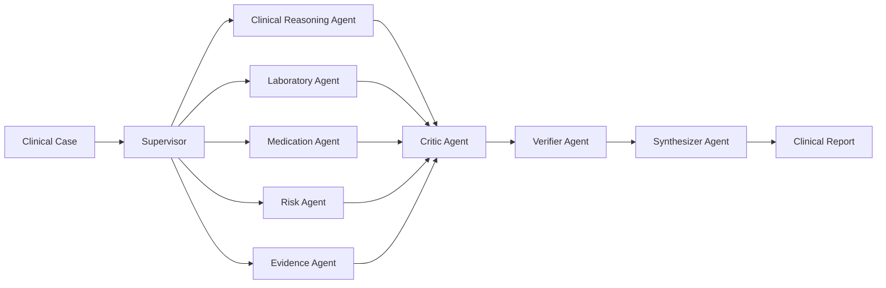

# 10 — Multi-Agent System

## What is an AI Agent?

An **AI agent** is a software entity that:
1. Receives input (task data, patient context).
2. Applies reasoning (LLM inference or rule-based logic).
3. Produces a structured output.
4. May take actions (though in this system, agents only produce analysis).

Think of an agent like a specialist doctor: a cardiologist knows hearts, a radiologist knows imaging. Each specialist has focused expertise.

---

## What is a Multi-Agent System?

A **Multi-Agent System (MAS)** is a collection of agents that collaborate to solve a problem that is too complex for one agent alone.



---

## Why Multiple Agents? (vs Single LLM)

| Concern | Single LLM | Multi-Agent |
|---------|-----------|-------------|
| Focus | Tries to do everything | Each agent has one focused job |
| Hallucination | High risk — no cross-check | Each agent challenged by Critic |
| Output structure | Unpredictable format | Each agent's output is Pydantic-validated |
| Transparency | Opaque single answer | Traceable per-agent reasoning |
| Scalability | Can't easily add new capability | Add one new agent class |
| Conflict detection | None | Supervisor + Critic identify contradictions |
| Audit | One log entry | Full per-agent blockchain proof |

---

## Agent Design Principles

Every agent in this system follows these principles:

### 1. Single Responsibility
Each agent does exactly one thing. The Laboratory Agent doesn't do medication checks. The Critic doesn't synthesize.

### 2. Typed Output
Every agent produces output that is validated against a **Pydantic BaseModel**. If the output doesn't match — the run is flagged.

### 3. Medical Safety by Default
Every LLM agent (Groq mode) has the **Medical Safety Preamble** injected automatically:
> "NEVER fabricate patient data. NEVER claim definitive diagnosis. ALWAYS recommend clinician review."

### 4. Confidence Reporting
Every agent reports a `confidence: float` (0.0–1.0). This is model-reported confidence, **not clinical accuracy**. It feeds into the consensus calculation.

### 5. Failure Isolation
If one agent fails (exception), the workflow continues with the remaining agents. The failure is recorded as an anomaly.

---

## Dynamic Agent Selection

The **Supervisor Agent** dynamically selects which agents run based on the clinical case content.

### How it Works

**In Mock Mode** (rule-based keyword detection, `mock_agents.py`):
```python
required = ["clinical_reasoning", "verifier", "synthesizer"]  # always

if "lab" or "blood" or "hemoglobin" in description:
    required += ["laboratory", "risk"]

if "medication" or "drug" or "prescription" in description:
    required += ["medication", "history"]

if "complex" or "critical" or "emergency" in description:
    complexity = "high"
    required += ["history", "evidence", "risk", "critic"]
```

**In LLM Mode** (Groq reasoning):
The Supervisor receives the case description and a schema requiring `required_agents: list[str]`. The LLM decides which agents are needed based on the clinical presentation.

### Constraints (Always Included)
These agents always run regardless of case type:
- `clinical_reasoning` — always needed
- `verifier` — always needed for safety
- `synthesizer` — always needed for final report

---

## Is This "True" Multi-Agent?

This is an important question for your viva. Be honest:

| Capability | Status | Evidence |
|------------|--------|---------|
| Multiple independent agents | ✅ YES | 10 distinct classes with different prompts/schemas |
| Dynamic agent selection | ✅ PARTIAL | Supervisor selects, but workflow is always sequential |
| Supervisor coordination | ✅ YES | GroqSupervisorAgent / MockSupervisorAgent |
| Parallel agent execution | ❌ NO | `for agent_role, agent in agents.items(): await agent.execute()` — sequential |
| Critic → revision loop | ❌ NO | Critic produces output, but workflow does not re-run agents based on it |
| Agent-to-agent messaging | ❌ NO | Agents receive `previous_outputs` as read-only context, no active messaging |
| Typed agent-to-agent messages | ✅ YES | Pydantic schemas define typed inter-agent data |
| Shared workflow state | ✅ YES | `WorkflowResult` accumulates all state |
| Per-agent blockchain proof | ✅ YES | Each agent output gets its own `DecisionProof` |
| Independent memory | ❌ NO | No persistent episodic or semantic memory |

**Correct terminology**: This is a **supervised sequential multi-agent pipeline**, not a fully autonomous distributed MAS. The academic contribution is the **cryptographic provenance layer** applied to multi-agent clinical reasoning.

---

## Agent Communication Pattern

Agents do NOT send messages to each other directly. The Orchestrator passes context:

```python
# workflow.py — agent context accumulation
task_with_context = {**task_data, "previous_outputs": {}}

for agent_role, agent in agents.items():
    output = await agent.execute(task_with_context, {})
    task_with_context["previous_outputs"][agent_role] = output  # ← added
    result.agent_outputs[agent_role] = output
```

Each agent can read outputs from all previously run agents via `task["previous_outputs"]`. The **Synthesizer** in particular reads all previous outputs to compose its report.

---

## Agent Execution Order

The order is determined by the `required_agents` list from the Supervisor:

**Typical complex case order:**
```
1. [SUPERVISOR] — selects following agents
2. [MEDICAL HISTORY] — provide historical context
3. [CLINICAL REASONING] — differential diagnosis
4. [LABORATORY] — lab analysis
5. [MEDICATION SAFETY] — drug interaction check
6. [RISK ASSESSMENT] — urgency scoring
7. [EVIDENCE] — guideline matching
8. [CRITIC] — adversarial challenge
9. [VERIFIER] — safety check
10. [SYNTHESIZER] — final report
```

**Simple case (no labs, no meds):**
```
1. [SUPERVISOR]
2. [CLINICAL REASONING]
3. [VERIFIER]
4. [SYNTHESIZER]
```

---

## What Each Agent Receives

Every agent's `execute()` receives:
```python
task_data = {
    "title": "Patient case title",
    "description": "Full clinical description text",
    "patient_context": {          # from Task.patient_context JSON
        "age": 55,
        "symptoms": ["fever", "elevated WBC"],
        "current_medications": ["Metformin", "Lisinopril"],
        "lab_results": {...}
    },
    "previous_outputs": {         # accumulated from prior agents
        "history": {...},
        "clinical_reasoning": {...},
        ...
    }
}
```

> ⚠️ **Privacy Note**: The full patient context (including medications, allergies, diagnoses) is sent to Groq's API. In production, apply minimum-necessary data filtering before sending to external LLM providers.

---

## Agent Output Lifecycle

```
Agent produces dict output
        ↓
validate_output(output) — Pydantic validation
        ↓
store in result.agent_outputs[role]
        ↓
add to task_with_context["previous_outputs"]
        ↓
compute_sha256(canonical_json(output)) → content_hash
        ↓
encrypt_json(canonical_json(output)) → encrypted bytes
        ↓
storage.put_object(path, encrypted_bytes) → MinIO
        ↓
build DecisionProof dict
        ↓
fabric_service.record_decision_proof(proof) → tx_id
        ↓
result.proofs.append(proof)
```
