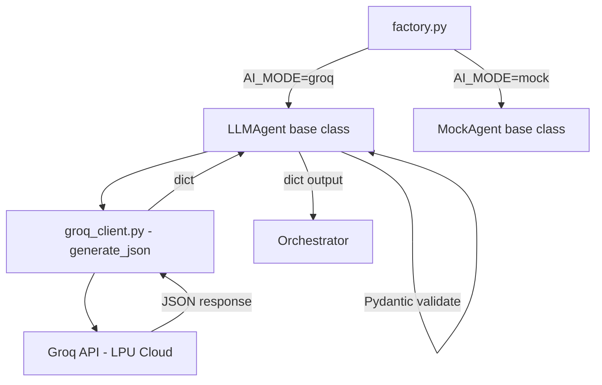

# 13 — LLM and Groq Integration

## LLM Architecture Overview



---

## AI Mode System

The system has three AI modes, set via `AI_MODE` in `.env`:

| Mode | Agents | Use When |
|------|--------|---------|
| `mock` | Rule-based, always return realistic hardcoded data | Development, demos without API key, testing |
| `llm` / `groq` | Real Groq API calls | Full system with valid API key |

### Mode Resolution (`factory.py`)
```python
def _resolve_ai_mode(mode: str | None) -> str:
    _AI_MODES = {"mock", "llm", "groq"}
    if mode in _AI_MODES:
        return mode
    # "blockchain" and "centralized" are coordination modes, NOT AI modes
    return settings.AI_MODE if settings.AI_MODE in _AI_MODES else "mock"
```

**Important**: `coordination_mode` ("blockchain" / "centralized") is different from `AI_MODE`. You can have blockchain mode with mock agents.

---

## LLMAgent Base Class (`llm_base.py`)

Every Groq-powered agent inherits from `LLMAgent`:

### System Prompt Construction
```python
def get_system_prompt(self) -> str:
    schema = self.get_output_schema()
    schema_json = schema.model_json_schema() if schema else {}
    
    return (
        f"You are the {self.name} (role: {self.role})...\n\n"
        f"{MEDICAL_SAFETY_PREAMBLE}\n"          # ← Always injected
        f"{self.system_instructions}\n\n"
        "OUTPUT FORMAT — STRICT JSON ONLY:\n"
        f"JSON Schema:\n{json.dumps(schema_json, indent=2)}\n\n"
        "IMPORTANT RULES:\n"
        "- confidence must be a float between 0.0 and 1.0\n"
        "- risk_level must be one of: 'low', 'medium', 'high'\n"
    )
```

**What this achieves**: The LLM receives the exact Pydantic JSON Schema as part of its instructions. This dramatically reduces schema violations by teaching the LLM the required field names, types, and enums.

### Medical Safety Preamble
Injected into EVERY LLM agent's system prompt (source: `llm_base.py`):
```
═══════════════════════════════════════════════════════
CRITICAL MEDICAL SAFETY CONSTRAINTS:
═══════════════════════════════════════════════════════
1. You are a CLINICAL DECISION-SUPPORT tool, NOT a physician.
2. You must NEVER fabricate patient information, lab values, or medications.
3. You must NEVER invent clinical data that was not provided.
4. You must NEVER claim a definitive diagnosis.
5. You must NEVER recommend autonomous prescribing.
6. Distinguish FACTS (data provided) from INFERENCE (your analysis).
7. Identify UNCERTAINTY — flag when information is insufficient.
8. Recommend qualified clinician review for all conclusions.
9. Your "confidence" field is model-reported, NOT clinical correctness.
10. Final clinical decisions MUST remain with qualified healthcare professionals.
═══════════════════════════════════════════════════════
```

---

## Groq Client (`groq_client.py`)

### `generate_json()` Function
```python
async def generate_json(
    system_prompt: str,
    user_prompt: str,
    model: str = "llama-3.1-8b-instant"
) -> dict:
    client = AsyncGroq(api_key=settings.GROQ_API_KEY)
    
    response = await client.chat.completions.create(
        model=model,
        messages=[
            {"role": "system", "content": system_prompt},
            {"role": "user", "content": user_prompt},
        ],
        response_format={"type": "json_object"},  # ← Forces JSON output
        temperature=0.1,                           # ← Low temp for structured output
        max_tokens=4096,
    )
    
    content = response.choices[0].message.content
    return json.loads(content)
```

**Key design decisions**:
- `response_format: json_object` — Groq guarantees valid JSON is returned.
- `temperature=0.1` — Very low temperature for reliably structured output.
- `max_tokens=4096` — Enough for complex synthesis outputs.

### Retry Logic
The client uses `tenacity` for retry on Groq API failures:
```python
@retry(
    stop=stop_after_attempt(3),
    wait=wait_exponential(multiplier=1, min=1, max=10),
    retry=retry_if_exception_type(groq.RateLimitError),
)
```

---

## Model Selection Strategy

**Heavy Model** (`llama-3.1-70b-versatile`): Used for roles requiring deep reasoning:
- `supervisor` — must reason about case complexity and agent selection
- `clinical_reasoning` — differential diagnosis requires multi-step reasoning
- `synthesizer` — must integrate all agent outputs coherently
- `risk` — clinical risk stratification is nuanced

**Fast Model** (`llama-3.1-8b-instant`): Used for roles with more structured tasks:
- `history` — pattern matching from patient history
- `laboratory` — comparison against reference ranges
- `medication` — known interaction lookup
- `evidence` — guideline retrieval (from training data)
- `critic` — rule-based checking
- `verifier` — consistency checking

**Rationale**: Latency multiplies in multi-agent pipelines. Using the 8B model for simpler agents reduces total workflow latency without sacrificing quality where it matters.

---

## Mock Mode Details

When `AI_MODE=mock`, the factory creates `MockXxxAgent` instances instead of `GroqXxxAgent`. Mock agents:

1. **Always produce valid Pydantic output** — no schema failures.
2. **Use case-specific keyword detection** — some personalization.
3. **Return realistic hardcoded clinical data** — useful for demos.
4. **Latency**: <1ms (no API call).

**Limitation**: Mock agents always return similar data regardless of the specific patient case. They do not truly reason.

---

## Switching Between Modes

```bash
# In .env:

# Mock mode (default/safe):
AI_MODE=mock

# Real LLM (requires API key):
AI_MODE=groq
GROQ_API_KEY=gsk_xxxxxxxxxxxxxxxx

# Restart backend after changing:
# Ctrl+C then python -m uvicorn app:app --reload
```

---

## Current AI Limitations

| Limitation | Description | Impact |
|-----------|-------------|--------|
| No RAG | Evidence Agent uses training data, not real guidelines | May hallucinate outdated guidelines |
| No tool calling | Agents cannot query databases | Cannot fetch real patient history dynamically |
| No memory | Each run is stateless | Cannot learn from previous cases |
| No critic loop | Critic findings don't trigger re-analysis | Identified issues are reported but not acted on |
| Training cutoff | Groq models have knowledge cutoff | May not know newest guidelines |
| Privacy | Patient context sent to external API | Data leaves the hospital in LLM mode |
