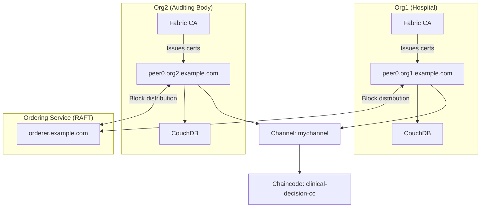

# 19 — Hyperledger Fabric

## Teaching Blockchain from Scratch

### What is a Blockchain?

A **blockchain** is an append-only, linked list of data blocks where:
- Each block contains a batch of transactions.
- Each block contains the hash of the previous block (creating the "chain").
- If you change block #5, its hash changes → block #6's "previous hash" is now wrong → the chain is broken.

This means **historical data cannot be modified** without breaking the entire chain — and every node in the network would detect the break.

### What is a Permissioned Blockchain?

A **permissioned blockchain** is a blockchain where participation is restricted to invited, authenticated organizations. Unlike Bitcoin or Ethereum (public — anyone can join), a permissioned blockchain:
- Has a known set of participants.
- Uses certificate-based identity (X.509).
- Has no cryptocurrency or gas fees.
- Can process thousands of transactions per second.
- Is governed by the participating organizations.

---

## Hyperledger Fabric Components



---

## Core Concepts Explained

### Organization
A **participant entity** in the network. In this project:
- **Org1**: The hospital — submits decision proofs.
- **Org2**: The auditing authority — can verify proofs independently.

### Peer
A **node** that maintains the ledger and runs chaincode. Each organization has at least one peer. Peers:
- Maintain the ledger (all historical blocks).
- Execute chaincode (smart contracts).
- Endorse transactions (validate and sign before ordering).

### Orderer
The **ordering service** sequences transactions into blocks. It does NOT execute chaincode — it just orders transactions and distributes them to peers.

In this project: **RAFT-based ordering** — a crash-fault-tolerant consensus mechanism suitable for enterprise use.

### Channel
A **private communication subnet** within the Fabric network. Organizations on the same channel share a private ledger. Organizations NOT on the channel cannot see its data.

In this project: `mychannel` — shared between Org1 and Org2.

### Chaincode
**Smart contracts** written in Go, Java, or Node.js — deployed on peers and executed during transactions. Chaincode defines the business logic: what data can be stored, how it can be updated, and who is authorized.

In this project: `clinical-decision-cc` — a Go chaincode defining decision proof storage.

### World State
The **current state database** — a key-value or document store (CouchDB in this project) holding the latest value for each asset. Think of it like a cache of the current ledger state, optimized for queries.

### Ledger
The **immutable record** — an append-only blockchain file containing all historical transactions. The world state is derived from the ledger. If the world state is corrupted, it can be rebuilt by replaying the ledger.

### MSP (Membership Service Provider)
The component that manages identities within an organization. MSP validates:
- Who a user/node is (their certificate).
- What role they have (admin, client, peer).
- Whether they belong to this organization.

### CA (Certificate Authority)
Issues X.509 certificates to users, peers, and orderers. Used to authenticate identities in the network.

### Endorsement
Before a transaction is committed, it must be **endorsed** by peers according to the **endorsement policy**. Example policy: "At least 1 peer from Org1 AND 1 peer from Org2 must sign."

### Transaction Lifecycle
```
Client (Backend)
    ↓ Proposal
Peer (endorsement)
    ↓ Endorsed response
Client
    ↓ Submit to orderer
Orderer 
    ↓ Order into block
All peers
    ↓ Validate + commit
Ledger updated
```

---

## This Project's Fabric Network

### Network Configuration

| Component | Name | Port |
|-----------|------|------|
| Org1 Peer | peer0.org1.example.com | 7051 |
| Org2 Peer | peer0.org2.example.com | 9051 |
| Orderer | orderer.example.com | 7050 |
| Org1 CA | ca.org1.example.com | 7054 |
| Org2 CA | ca.org2.example.com | 8054 |
| Org1 CouchDB | couchdb0 | 5984 |
| Org2 CouchDB | couchdb1 | 7984 |
| Org1 Gateway | peer0.org1 | 7051 (gRPC) |

### Channel Setup
- Channel name: `mychannel`
- Both Org1 and Org2 join the channel.
- Genesis block created from channel configuration.

### Chaincode
- Name: `clinical-decision-cc`
- Language: Go
- Location: `blockchain/chaincode/contract.go`
- Package: `main`

### MSP IDs
- Org1: `Org1MSP`
- Org2: `Org2MSP`
- Orderer: `OrdererMSP`

---

## Starting the Fabric Network

```bash
cd blockchain/scripts

# 1. Generate crypto material (certificates and keys)
./generate-crypto.sh

# 2. Create channel artifacts
./create-channel-artifacts.sh

# 3. Start Docker containers
docker-compose -f ../docker-compose-fabric.yml up -d

# 4. Create channel
./create-channel.sh mychannel

# 5. Join peers to channel
./join-channel.sh peer0.org1 mychannel
./join-channel.sh peer0.org2 mychannel

# 6. Package and deploy chaincode
./deploy-chaincode.sh clinical-decision-cc ../chaincode 1 1

# 7. Verify channel
docker exec peer0.org1.example.com peer channel list
```

---

## What Happens Without Fabric?

The system is designed to still function if Fabric is unavailable:

1. `gateway.py` attempts connection to the peer endpoint.
2. If connection fails → `_connected = False`.
3. In `centralized` mode: `fabric_tx_id = f"local-{uuid.hex[:16]}"` — still records proofs in DB.
4. In `blockchain` mode with failed connection → `blockchain.failed` event appended to timeline.
5. `DecisionProof.fabric_ledger_status = "local"` vs `"committed"`.

You can always distinguish real Fabric transactions from local ones:
- **Real**: `fabric_tx_id = "a1b2c3d4..."` (64-char hex from Fabric chaincode)
- **Local stub**: `fabric_tx_id = "local-a1b2c3d4e5f6g7h8"` (prefixed with "local-")

---

## Fabric vs Other Blockchains

| Feature | Hyperledger Fabric | Ethereum | Bitcoin |
|---------|-------------------|----------|---------|
| Permission | Permissioned (invite-only) | Permissionless | Permissionless |
| Privacy | Channel isolation | Public | Public |
| Gas fees | None | Required | Required (fees) |
| TPS | 1,000-3,500 | ~15 | ~7 |
| Smart contracts | Go, Java, Node.js chaincode | Solidity | Bitcoin Script |
| Identity | X.509 PKI certificates | Public/private key pairs | Public/private key pairs |
| Consensus | RAFT, BFT | PoW / PoS | PoW |
| Patient data suitability | ✅ Private + gated | ❌ Public | ❌ Public |
| Enterprise adoption | High (IBM, Oracle) | Medium | Low |
