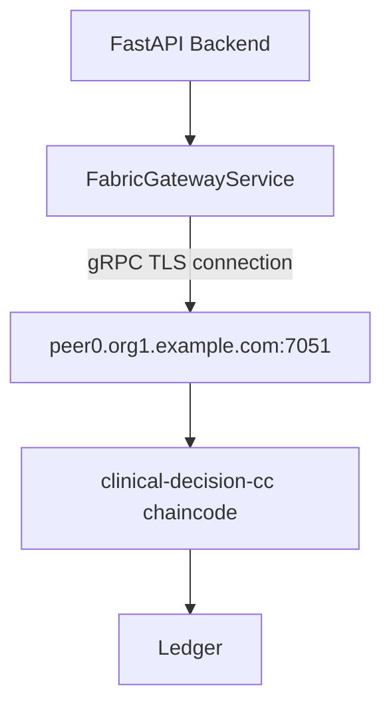

# 22 — Fabric Gateway

## Role of the Gateway

The **Fabric Gateway** is the Python application's connection point to the Hyperledger Fabric network. It abstracts the low-level gRPC communication into simple method calls.

**File**: `backend/blockchain/gateway.py`  
**Class**: `FabricGatewayService`

---

## Connection Architecture



---

## Current Implementation

### Connection Attempt Flow

```python
async def connect(self) -> bool:
    try:
        from fabric_sdk_py import Gateway  # Attempt real SDK import
        
        # Load X.509 identity
        with open(settings.FABRIC_CERT_PATH, "rb") as f:
            cert = f.read()
        with open(settings.FABRIC_KEY_PATH, "rb") as f:
            key = f.read()
        
        # Open gRPC connection to peer gateway
        self._gateway = Gateway(
            endpoint=settings.FABRIC_GATEWAY_ENDPOINT,
            cert=cert,
            key=key,
            tls_cert_path=settings.FABRIC_TLS_CERT_PATH,
        )
        self._connected = True
        return True
        
    except ImportError:
        # fabric_sdk_py not installed → graceful fallback
        logger.warning("fabric-gateway package not installed, using simulation")
        self._connected = False
        return False
        
    except Exception as e:
        logger.error(f"Fabric connection failed: {e}")
        self._connected = False
        return False
```

### `record_decision_proof()`

```python
async def record_decision_proof(self, proof_data: dict) -> dict:
    if not self._connected:
        # Simulation mode
        tx_id = uuid.uuid4().hex[:16]
        return {
            "tx_id": f"local-{tx_id}",
            "block_number": 0,
            "status": "local",
        }
    
    # Real Fabric transaction
    network = self._gateway.get_network(settings.FABRIC_CHANNEL_NAME)
    contract = network.get_contract(settings.FABRIC_CHAINCODE_NAME)
    
    result = await contract.submit_transaction(
        "RecordDecisionProof",
        proof_data["proof_id"],
        proof_data["task_id"],
        proof_data["run_id"],
        proof_data["agent_id"],
        proof_data["agent_role"],
        proof_data["organization"],
        proof_data["content_hash"],
        proof_data["hash_algorithm"],
        proof_data["storage_reference"] or "",
        str(proof_data.get("output_version", 1)),
        str(proof_data.get("confidence", 0.0)),
    )
    
    return {
        "tx_id": result.transaction_id,
        "block_number": result.block_number,
        "status": "committed",
    }
```

---

## Graceful Degradation Pattern

This is a critical design decision. The system never crashes due to Fabric unavailability:

```
FabricGatewayService.connect()
    ├── ImportError (SDK not installed)? → _connected = False → simulation
    ├── Network error (peer unreachable)? → _connected = False → simulation
    ├── Auth error (bad cert)? → _connected = False → simulation
    └── Success? → _connected = True → real Fabric

run_workflow(mode="blockchain"):
    if fabric_service and mode == "blockchain":
        try:
            tx = await fabric_service.record_decision_proof(proof)
            proof["fabric_tx_id"] = tx["tx_id"]     # "local-..." or real TX
        except ConnectionError:
            proof["fabric_ledger_status"] = "failed"
            result.add_event("blockchain.failed")
    
    # Workflow continues regardless
```

---

## How to Distinguish Real vs Simulated TX IDs

| TX ID Format | Meaning |
|-------------|---------|
| `"a1b2c3d4..."` (64-char hex) | **Real** Fabric TX ID from chaincode |
| `"local-f4e3d2c1b0a9..."` | **Simulated** — generated locally, not on Fabric |

Always check `fabric_ledger_status`:
- `"committed"` — written to Fabric
- `"local"` — centralized mode or simulation
- `"failed"` — blockchain submission failed

---

## Configuration (`backend/core/config.py`)

```python
FABRIC_GATEWAY_ENDPOINT: str = "localhost:7051"    # peer gRPC address
FABRIC_MSP_ID: str = "Org1MSP"                     # Organization MSP ID
FABRIC_CHANNEL_NAME: str = "mychannel"             # Channel name
FABRIC_CHAINCODE_NAME: str = "clinical-decision-cc" # Chaincode package name
FABRIC_CERT_PATH: str = ""                         # Path to identity cert.pem
FABRIC_KEY_PATH: str = ""                          # Path to identity key.pem
FABRIC_TLS_CERT_PATH: str = ""                     # Path to TLS CA cert
```

---

## `get_network_status()` Response

```python
async def get_network_status(self) -> dict:
    return {
        "connected": self._connected,
        "fabric_endpoint": settings.FABRIC_GATEWAY_ENDPOINT,
        "channel": settings.FABRIC_CHANNEL_NAME,
        "chaincode": settings.FABRIC_CHAINCODE_NAME,
        "msp_id": settings.FABRIC_MSP_ID,
        "mode": "native" if self._connected else "simulation",
        "message": (
            "Connected to Hyperledger Fabric" if self._connected
            else "Fabric gateway: simulated mode (peer unreachable or SDK not installed)"
        ),
    }
```

This powers the **Blockchain** status page in the Admin portal.
