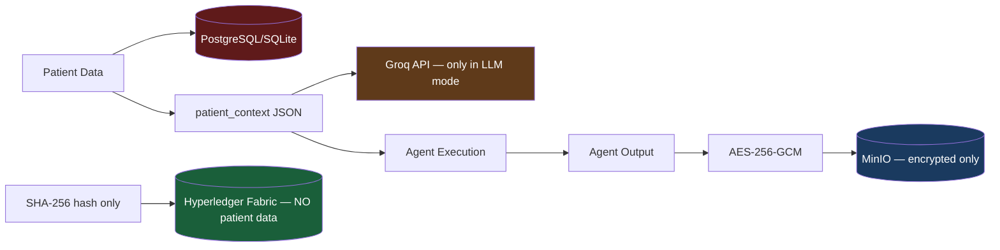

# 25 — Privacy and Clinical Safety

## Privacy Architecture

### What Patient Data Goes Where



---

## Privacy Properties

### ✅ What Is Guaranteed

| Property | Implementation |
|----------|---------------|
| Patient data NOT on blockchain | Only SHA-256 hashes on Fabric — no demographics, no diagnoses |
| Agent outputs encrypted at rest | AES-256-GCM before MinIO storage |
| No plaintext in blockchain | Neither patient data nor AI output exist in plaintext on Fabric |
| Role isolation | Patients cannot access other patients' records |

### ⚠️ What Is NOT Guaranteed (Academic Scope)

| Risk | Current Status |
|------|---------------|
| Patient data sent to Groq | In LLM mode, `patient_context` is sent to Groq's API (external) |
| PHI in plaintext in DB | Patient demographics stored as plaintext SQLite/PostgreSQL |
| Encryption key in .env | AES key accessible to any process reading .env |
| No HIPAA compliance | System not audited for HIPAA/GDPR compliance |
| IDOR patient access | Partial row-level security only |

---

## Clinical Safety Framework

### The 10 Mandatory Safety Rules

Every LLM agent's system prompt contains these rules (verbatim from `llm_base.py`):

```
═══════════════════════════════════════════════════════════════════
CRITICAL MEDICAL SAFETY CONSTRAINTS — YOU MUST FOLLOW ALL OF THESE:
═══════════════════════════════════════════════════════════════════
1. You are a CLINICAL DECISION-SUPPORT tool, NOT a physician.
2. You must NEVER fabricate patient information, lab values, or medications.
3. You must NEVER invent clinical data that was not provided to you.
4. You must NEVER claim a definitive diagnosis — always present differentials.
5. You must NEVER recommend autonomous prescribing or treatment without clinician review.
6. You must distinguish clearly between FACTS (data provided to you) and INFERENCE.
7. You must identify UNCERTAINTY — flag when information is insufficient.
8. You must recommend qualified clinician review for all clinical conclusions.
9. Your "confidence" field represents model-reported confidence, NOT clinical correctness.
   High confidence does NOT mean the output is medically accurate.
10. Final clinical decisions MUST remain with qualified healthcare professionals.
═══════════════════════════════════════════════════════════════════
```

### The Mandatory Disclaimer

The **Synthesizer Agent** (final report producer) always includes in its `SynthesisOutput`:

```python
disclaimer: str = (
    "⚠️ AI-GENERATED CLINICAL DECISION SUPPORT — NOT A SUBSTITUTE FOR CLINICAL JUDGMENT. "
    "This report was generated by an AI multi-agent system and must be reviewed by a "
    "licensed healthcare professional before any clinical action is taken. "
    "The system does not diagnose, prescribe, or replace medical judgment."
)
```

This field is **required** by the Pydantic schema — it cannot be omitted.

---

## What Blockchain Guarantees vs What It Doesn't

| Guarantee | Blockchain Role |
|-----------|----------------|
| The AI gave THIS exact answer at THIS time | ✅ Hash proves content at timestamp |
| The AI answer was medically correct | ❌ Blockchain only proves provenance, not truth |
| Patient data is private | ✅ Patient data is never stored on chain |
| Nobody modified the answer later | ✅ Hash mismatch detection catches tampering |
| The AI is safe to use for clinical decisions | ❌ Always requires human review |

---

## HIPAA Considerations (Academic Note)

This system is NOT HIPAA-compliant for deployment with real patient data.

For HIPAA compliance, a production system would need:
1. **Business Associate Agreement (BAA)** with Groq if sending PHI.
2. **PHI encryption at rest** — all patient fields in the database encrypted, not just AI outputs.
3. **Audit logging** — the system has audit events, but HIPAA requires specific retention periods and access logging.
4. **Access controls** — HIPAA requires detailed role-based access with patient-level permissions.
5. **Breach notification procedures**.
6. **Risk assessment documentation**.

---

## Minimum Necessary Data Principle

A recommended future improvement: Before passing `patient_context` to AI agents, apply **minimum necessary filtering** — only send fields actually needed for the agent's job.

```python
# Current: Entire patient context sent to every agent
task_data["patient_context"] = full_patient_context

# Better: Role-specific context filtering
LAB_AGENT_FIELDS = ["lab_results", "age", "gender", "chronic_conditions"]
MED_AGENT_FIELDS = ["current_medications", "allergies", "age"]

task_data["patient_context"] = {
    k: v for k, v in full_patient_context.items()
    if k in AGENT_REQUIRED_FIELDS[agent_role]
}
```

This would reduce the amount of PHI sent to the Groq API in LLM mode.
